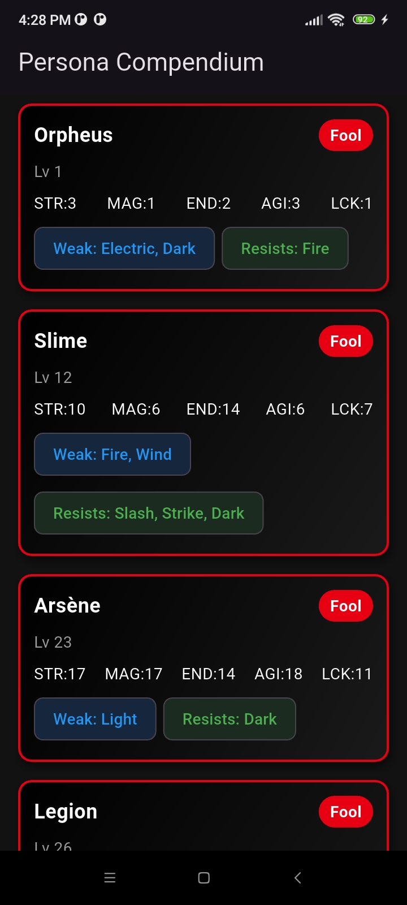
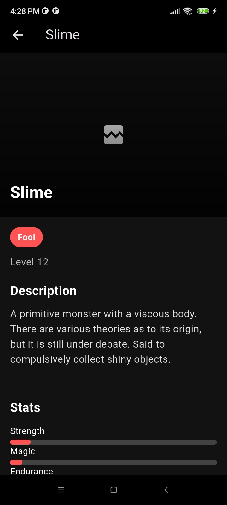
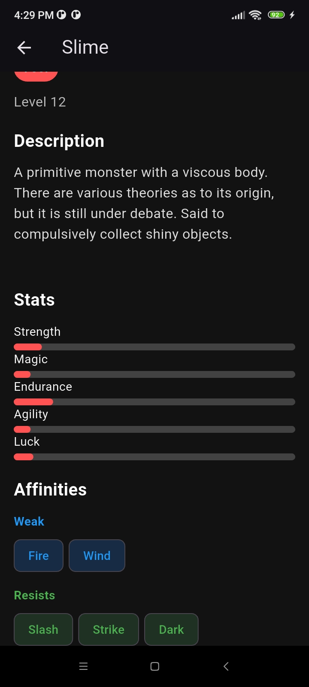

# Persona Flutter App

This **Persona Flutter App** is a beautiful and interactive **Persona 5-inspired** compendium showcasing Persona characters with stats, affinities, and abilities. The app displays **character information**, **stats**, **affinities** (weaknesses, resistances, etc.), and allows you to **view detailed images**.

---

## Features

- **Persona Compendium**: A full list of Persona characters with details like **name, arcana, level**, and **image**.
- **Persona Stats**: View detailed **stats** for each Persona including **Strength, Magic, Endurance, Agility**, and **Luck** in a stylish Persona 5 theme.
- **Affinity System**: Visualize each Persona's **weaknesses**, **resistances**, **reflects**, **absorbs**, and **nullifies** using colorful chips.
- **Hero Image**: Persona images with a **red-black gradient overlay** for a cinematic experience.
- **Responsive UI**: The app adjusts smoothly for various screen sizes and orientations.
- **View Full Image**: Opens the full image in an external browser.

---

## App Screenshots

### 1. Persona Compendium Card View  
Displays a list of Persona characters with **arcana**, **level**, and **stats**. Each card is clickable to open the detailed Persona screen.

---

### 2. Persona Detail Screen  
Shows a **large hero image**, **Persona stats**, and **affinity system** with a red-black gradient overlay, following the **Persona 5** style.


---

### 3. Affinity Chips  
Displays the **weaknesses**, **resistances**, **reflects**, and **absorbs** of each Persona with color-coded chips.


---

<table>
  <tr>
    <td>
      
    </td>
     <td>
      
    </td>
     <td>
      
    </td>
  </tr>
</table>

## Installation

### Prerequisites

- Install **Flutter SDK**: [Installation Guide](https://flutter.dev/docs/get-started/install)
- **Android Studio** or **VS Code** (with Flutter plugin)

### Clone the Repository

```bash
git clone https://github.com/yourusername/persona-flutter.git
cd persona-flutter
